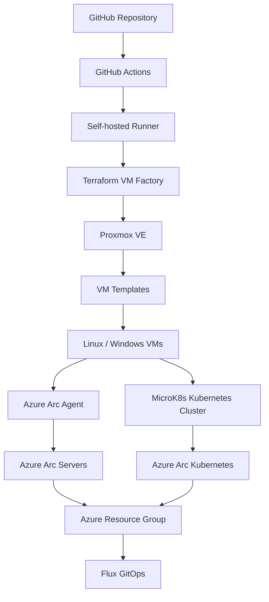

# 🏗 Hybrid Proxmox + Azure Arc Lab

A **hybrid infrastructure lab** built to practice **Azure Arc, Kubernetes, GitOps, and DevOps automation** using a local **Proxmox environment** integrated with **Microsoft Azure**.

This lab simulates a **real hybrid cloud environment** where on‑prem servers and Kubernetes clusters are managed from Azure using **Azure Arc**.

The environment is designed to support learning for:

- **AZ‑104 – Azure Administrator**
- **AZ‑400 – Azure DevOps Engineer**

---

# 📐 Architecture Overview



---

# 🎯 Lab Goals

This lab is used to practice:

• Azure Arc hybrid management  
• Kubernetes cluster management  
• GitOps deployments with Flux / ArgoCD  
• Terraform infrastructure automation  
• Hybrid cloud architecture design  

---

# ☁ Azure Environment

Resource Group:

```
rg-arc-home-lab
```

Region:

```
Norway East
```

Azure is used for:

- Azure Arc management
- Kubernetes Arc integration
- GitOps deployments
- Cluster Connect
- Hybrid server management
- Policy and governance

---

# 🖥 On‑Prem Infrastructure (Proxmox)

Hypervisor:

```
Proxmox VE
```

Node:

```
pve
```

Network:

```
vmbr0
```

Storage:

```
local       → cloud-init snippets
local-lvm   → VM disks
```

---

# 🧠 VM Factory (Terraform)

VM provisioning is fully automated using Terraform.

Infrastructure is declared as code and deployed via **GitHub Actions**.

Example VM definition:

```hcl
vms = {
  ubuntu-static-01 = {
    os        = "linux"
    cores     = 2
    memory_mb = 4096

    network = {
      type    = "static"
      address = "192.168.10.30/24"
      gateway = "192.168.10.1"
    }

    arc = true
  }
}
```

Supported features:

| Feature | Supported |
|------|------|
Linux VM | ✅ |
Windows VM | ✅ |
DHCP networking | ✅ |
Static IP | ✅ |
Azure Arc onboarding | ✅ |
GitOps deployments | ✅ |

---

# 🖥 Virtual Machines

The lab contains three main virtual machines.

| VM | Role | Description |
|----|------|-------------|
microk8s-01 | Kubernetes node | Runs MicroK8s cluster |
ubuntu-utils-01 | Tools server | Azure CLI, Terraform, DNS |
win-admin-01 | Windows admin | Arc-enabled Windows management VM |

---

# ☸ Kubernetes Environment

Cluster:

```
microk8s-01
```

Installed components:

- MicroK8s
- Ingress Controller
- MetalLB
- Azure Arc agents
- ArgoCD

---

# ☁ Azure Arc – Kubernetes

The MicroK8s cluster is connected to Azure using **Azure Arc for Kubernetes**.

Check connection status:

```
az connectedk8s show -g rg-arc-home-lab -n microk8s-01
```

Arc deploys the following agents into the cluster:

- clusterconnect-agent
- kube-aad-proxy
- extension-manager
- config-agent
- metrics-agent
- resource-sync-agent

These enable Azure to manage and monitor the Kubernetes cluster.

---

# ☁ Azure Arc – Servers

Two virtual machines are connected as **Arc-enabled servers**.

| Server | OS |
|------|------|
ubuntu-utils-01 | Linux |
win-admin-01 | Windows |

Check status:

```
az connectedmachine list -g rg-arc-home-lab
```

Azure Arc enables:

- Remote management
- Policy enforcement
- Monitoring
- Update management

---

# 🌐 DNS

DNS services run on:

```
ubuntu-utils-01
```

This server also hosts:

- Azure CLI
- Terraform
- management utilities

---

# 🔄 CI/CD Pipeline

Infrastructure changes are deployed through GitHub Actions.

Pipeline flow:

```
terraform init
terraform plan
terraform show tfplan
cleanup old Arc resources
terraform apply
```

Results:

1. Terraform provisions VMs in Proxmox
2. cloud-init configures the OS
3. Azure Arc agent installs automatically
4. Machines appear in Azure Arc

---

# 🗑 Destroy Workflow

When infrastructure is destroyed:

```
terraform destroy
```

The workflow:

1. Reads Terraform state
2. Finds Arc-enabled machines
3. Deletes Arc resources
4. Removes VMs from Proxmox

Result:

```
No orphan Azure Arc resources
```

---

# 📦 Repository Structure

```
.
├── main.tf
├── locals.tf
├── variables.tf
├── providers.tf
├── outputs.tf
├── checks.tf
│
├── cloudinit/
│   ├── linux.yaml.tftpl
│   └── windows.yaml.tftpl
│
└── .github/
    ├── workflows/
    │   ├── terraform-plan.yml
    │   ├── terraform-apply.yml
    │   └── terraform-destroy.yml
    │
    └── scripts/
        ├── extract_arc_names_from_plan.py
        └── extract_arc_names_from_state.py
```

---

# 🧠 Design Decisions

Terraform state is stored locally on the runner:

```
/opt/terraform-state/proxmox-ubuntu-vm-factory
```

Azure Arc onboarding occurs during provisioning:

```
arc = true
```

If Arc is disabled later, the machine must be disconnected manually or reprovisioned.

---

# 🚀 Future Improvements

Possible expansions for the lab:

• Multi-node Kubernetes cluster  
• Flux GitOps automation  
• Azure Policy enforcement  
• Azure Monitor integration  
• Automated patching via Update Manager  

---

# 📜 License

MIT
