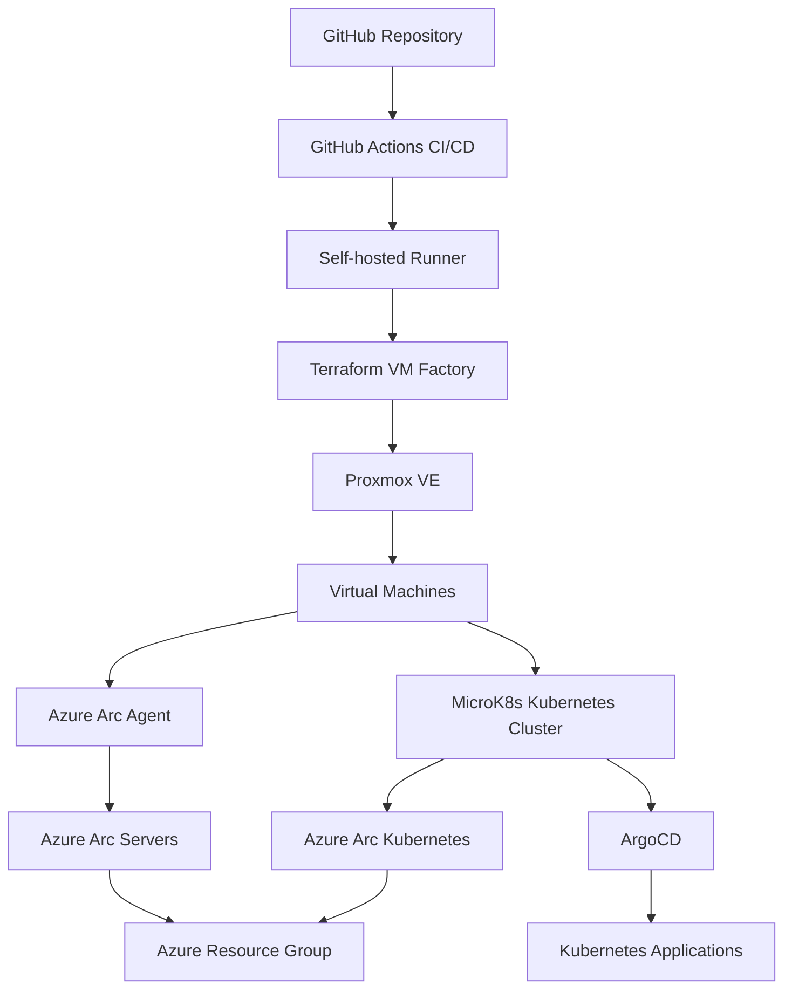

# 🏗 Hybrid Azure Arc + Proxmox + Kubernetes Lab

A **hybrid cloud lab environment** built to practice **Azure Arc, Kubernetes, Terraform, and DevOps automation** using a local **Proxmox infrastructure** integrated with **Microsoft Azure**.

This lab simulates a **real-world hybrid architecture** where on‑premises virtual machines and Kubernetes clusters are managed from Azure using **Azure Arc**.

The environment is designed to support learning and experimentation for:

- **AZ‑104 – Azure Administrator**
- **AZ‑400 – DevOps Engineer**
- Hybrid infrastructure design
- Kubernetes operations
- Infrastructure as Code

---

# 🎯 Lab Objectives

This lab focuses on practicing:

• Hybrid cloud architecture  
• Azure Arc server management  
• Azure Arc Kubernetes integration  
• Terraform infrastructure automation  
• GitHub Actions CI/CD pipelines  
• Kubernetes application delivery with **ArgoCD**  

Infrastructure provisioning and lifecycle is handled by **Terraform + GitHub Actions**, while **ArgoCD manages Kubernetes applications**.

---

# 📐 High-Level Architecture



---

# ☁ Azure Environment

Resource Group:

```
rg-arc-home-lab
```

Region:

```
Norway East
```

Azure is used for:

• Azure Arc server management  
• Azure Arc Kubernetes integration  
• Cluster Connect  
• Policy & governance  
• Monitoring and hybrid management  

---

# 🖥 On‑Prem Infrastructure

Hypervisor:

```
Proxmox VE
```

Node:

```
pve
```

Network:

```
vmbr0
```

Storage:

```
local       → cloud-init snippets
local-lvm   → VM disks
```

---

# 🧠 Terraform VM Factory

VM provisioning is fully automated using **Terraform**.

Terraform configuration defines VM specifications and automatically deploys machines to Proxmox using the Proxmox API.

Example VM definition:

```hcl
vms = {
  ubuntu-static-01 = {
    os        = "linux"
    cores     = 2
    memory_mb = 4096

    network = {
      type    = "static"
      address = "192.168.10.30/24"
      gateway = "192.168.10.1"
    }

    arc = true
  }
}
```

Supported features:

| Feature | Supported |
|------|------|
Linux VM | ✅ |
Windows VM | ✅ |
DHCP networking | ✅ |
Static IP configuration | ✅ |
Azure Arc onboarding | ✅ |
GitHub Actions CI/CD | ✅ |

---

# 🖥 Virtual Machines

The lab currently contains three main VMs.

| VM | Role | Description |
|----|------|-------------|
microk8s-01 | Kubernetes node | Runs the MicroK8s cluster |
ubuntu-utils-01 | Utility server | Azure CLI, Terraform, DNS |
win-admin-01 | Windows admin | Arc‑enabled Windows management server |

---

# ☸ Kubernetes Environment

Cluster:

```
microk8s-01
```

Installed components:

• MicroK8s  
• Ingress Controller  
• MetalLB  
• Azure Arc agents  
• **ArgoCD**  

ArgoCD is used for **Kubernetes application delivery**.

---

# ☁ Azure Arc – Kubernetes

The MicroK8s cluster is connected to Azure using **Azure Arc for Kubernetes**.

Verify connection:

```
az connectedk8s show -g rg-arc-home-lab -n microk8s-01
```

Arc installs the following agents:

• clusterconnect-agent  
• kube-aad-proxy  
• extension-manager  
• config-agent  
• metrics-agent  
• resource-sync-agent  

These allow Azure to manage and monitor the Kubernetes cluster.

---

# ☁ Azure Arc – Servers

Two machines are connected as **Arc-enabled servers**.

| Server | OS |
|------|------|
ubuntu-utils-01 | Linux |
win-admin-01 | Windows |

Check status:

```
az connectedmachine list -g rg-arc-home-lab
```

Capabilities include:

• Remote management  
• Policy enforcement  
• Monitoring  
• Update management  

---

# 🌐 DNS & Utility Services

DNS and administrative tooling run on:

```
ubuntu-utils-01
```

This machine hosts:

• Azure CLI  
• Terraform  
• DNS services  
• general admin tools  

---

# 🔄 Infrastructure CI/CD

Infrastructure changes are deployed through **GitHub Actions**.

Pipeline workflow:

```
terraform init
terraform plan
terraform show tfplan
terraform apply
```

Deployment process:

1. Terraform provisions VMs in Proxmox  
2. cloud-init configures the operating system  
3. Azure Arc agent installs automatically  
4. Machines appear in Azure Arc  

---

# 🗑 Destroy Workflow

When infrastructure is destroyed:

```
terraform destroy
```

The pipeline:

1. Reads Terraform state  
2. Detects Arc-enabled machines  
3. Deletes Azure Arc resources  
4. Removes VMs from Proxmox  

Result:

```
No orphan Azure Arc resources
```

---

# 📦 Repository Structure

```
.
├── main.tf
├── locals.tf
├── variables.tf
├── providers.tf
├── outputs.tf
├── checks.tf
│
├── cloudinit/
│   ├── linux.yaml.tftpl
│   └── windows.yaml.tftpl
│
└── .github/
    ├── workflows/
    │   ├── terraform-plan.yml
    │   ├── terraform-apply.yml
    │   └── terraform-destroy.yml
```

---

# 🧠 Design Decisions

Terraform state is stored on the runner:

```
/opt/terraform-state/proxmox-ubuntu-vm-factory
```

Azure Arc onboarding occurs during VM provisioning:

```
arc = true
```

If Arc is disabled later, the machine must be disconnected manually or reprovisioned.

---

# 🚀 Future Improvements

Planned expansions for the lab:

• Multi‑node Kubernetes cluster  
• Azure Monitor integration  
• Azure Policy enforcement  
• GitOps infrastructure modules  
• Automated patching via Update Manager  

---

# 📜 License

MIT
