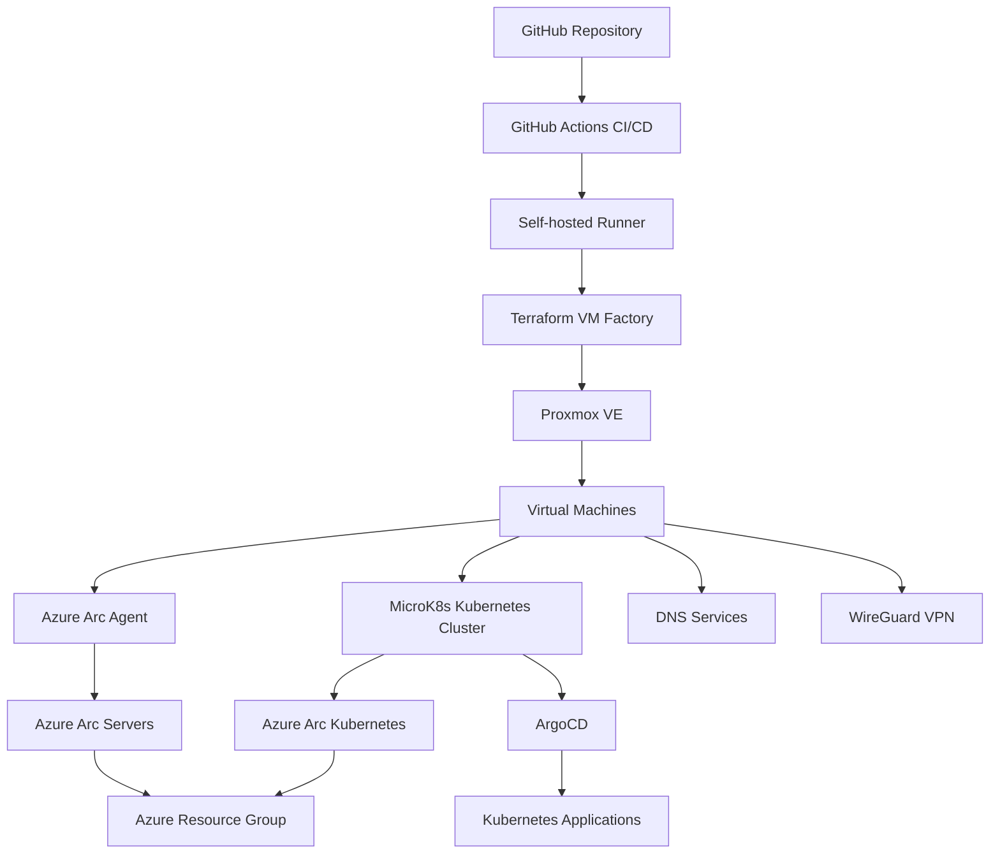

# 🏗 Hybrid Azure Arc + Proxmox + Kubernetes Lab

A **hybrid cloud lab environment** built to practice **Azure Arc, Kubernetes, Terraform, and DevOps automation** using a local **Proxmox infrastructure** integrated with **Microsoft Azure**.

This lab simulates a **real-world hybrid architecture** where on-premises virtual machines and Kubernetes clusters are managed from Azure using **Azure Arc**.

The environment is designed to support learning and experimentation for:

- **AZ-104 – Azure Administrator**
- **AZ-400 – DevOps Engineer**
- Hybrid infrastructure design
- Kubernetes operations
- Infrastructure as Code

---

# 🎯 Lab Objectives

This lab focuses on practicing:

- Hybrid cloud architecture
- Azure Arc server management
- Azure Arc Kubernetes integration
- Terraform infrastructure automation
- GitHub Actions CI/CD pipelines
- Kubernetes application delivery with **ArgoCD**
- Supporting services such as **DNS** and **WireGuard VPN**

Infrastructure provisioning and lifecycle is handled by **Terraform + GitHub Actions**, while **ArgoCD manages Kubernetes applications** inside the Kubernetes environment.

---

# 📐 High-Level Architecture



---

# ☁ Azure Environment

Resource Group:

```text
rg-arc-home-lab
```

Region:

```text
Norway East
```

Azure is used for:

- Azure Arc server management
- Azure Arc Kubernetes integration
- Cluster Connect
- Policy & governance
- Monitoring and hybrid management

---

# 🖥 On-Prem Infrastructure

Hypervisor:

```text
Proxmox VE
```

Node:

```text
pve
```

Network:

```text
vmbr0
```

Storage:

```text
local       → cloud-init snippets
local-lvm   → VM disks
```

---

# 🧠 Terraform VM Factory

VM provisioning is fully automated using **Terraform**.

Terraform configuration defines VM specifications and automatically deploys machines to Proxmox using the Proxmox API. The repository now reflects the cleaned and current Terraform structure used by the lab.

Example VM definition:

```hcl
vms = {
  ubuntu-static-01 = {
    os        = "linux"
    cores     = 2
    memory_mb = 4096

    network = {
      type    = "static"
      address = "192.168.10.30/24"
      gateway = "192.168.10.1"
    }

    arc = true
  }
}
```

Supported features:

| Feature | Supported |
|------|------|
| Linux VM | ✅ |
| Windows VM | ✅ |
| DHCP networking | ✅ |
| Static IP configuration | ✅ |
| Azure Arc onboarding | ✅ |
| Arc cleanup before VM destroy | ✅ |
| GitHub Actions CI/CD | ✅ |
| Idempotent Terraform workflows | ✅ |

---

# 🖥 Virtual Machines

The lab currently contains **five VMs**.

| VM ID | VM Name | Role | Description |
|------:|---------|------|-------------|
| 100 | microk8s-01 | Kubernetes node | Runs the MicroK8s cluster |
| 101 | ubuntu-utils-01 | Utility server | Azure CLI, Terraform, admin tooling |
| 102 | win-admin-01 | Windows admin | Windows management and Arc testing |
| 103 | dns-01 | DNS server | Dedicated DNS services for the lab |
| 104 | wg-vpn-01 | VPN server | WireGuard VPN access into the lab |

This is the current VM inventory shown in Proxmox.

---

# ☸ Kubernetes Environment

Cluster:

```text
microk8s-01
```

Installed components:

- MicroK8s
- Ingress Controller
- MetalLB
- Azure Arc agents
- **ArgoCD**

ArgoCD is used for **Kubernetes application delivery**.

---

# ☁ Azure Arc – Kubernetes

The MicroK8s cluster is connected to Azure using **Azure Arc for Kubernetes**.

Verify connection:

```bash
az connectedk8s show -g rg-arc-home-lab -n microk8s-01
```

Arc installs the following agents:

- clusterconnect-agent
- kube-aad-proxy
- extension-manager
- config-agent
- metrics-agent
- resource-sync-agent

These allow Azure to manage and monitor the Kubernetes cluster.

---

# ☁ Azure Arc – Servers

Arc-enabled servers are onboarded through the Terraform-based provisioning flow where enabled.

Check status:

```bash
az connectedmachine list -g rg-arc-home-lab
```

Capabilities include:

- Remote management
- Policy enforcement
- Monitoring
- Update management

---

# 🌐 DNS, Utility and Remote Access Services

Supporting infrastructure is now split across dedicated machines instead of being concentrated on a single utility host.

| Service | Host |
|---------|------|
| Utility / admin tooling | `ubuntu-utils-01` |
| DNS | `dns-01` |
| VPN / remote access | `wg-vpn-01` |

### ubuntu-utils-01
Hosts general administrative tooling such as:

- Azure CLI
- Terraform
- General admin tools

### dns-01
Provides dedicated DNS services for the lab.

### wg-vpn-01
Provides **WireGuard VPN** connectivity for secure access into the lab environment.

---

# 🔄 Infrastructure CI/CD

Infrastructure changes are deployed through **GitHub Actions**.

Pipeline workflow:

```bash
terraform init
terraform plan
terraform show tfplan
terraform apply
```

Deployment process:

1. Terraform provisions VMs in Proxmox
2. cloud-init configures the operating system
3. Azure Arc agent installs automatically where enabled
4. Machines appear in Azure Arc

---

# 🗑 Destroy Workflow

When infrastructure is destroyed:

```bash
terraform destroy
```

The pipeline:

1. Reads Terraform state
2. Detects Arc-enabled machines
3. Deletes Azure Arc resources
4. Removes VMs from Proxmox

Result:

```text
No orphan Azure Arc resources
```

---

# 📦 Repository Structure

```text
.
├── main.tf
├── providers.tf
├── variables.tf
├── locals.tf
├── outputs.tf
├── checks.tf
├── cloudinit/
│   ├── linux.yaml.tftpl
│   ├── windows.yaml.tftpl
│   ├── Unattend.xml
│   └── cloudbase-init-proxmox.conf.example
└── .github/
    ├── workflows/
    │   ├── terraform-plan.yml
    │   ├── terraform-apply.yml
    │   └── terraform-destroy.yml
    └── scripts/
        ├── extract_arc_names_from_plan.py
        └── extract_arc_names_from_state.py
```

---

# 🔧 Self-Hosted Runner

| Setting | Value |
|---------|-------|
| Runner | gha-runner-01 |
| Labels | self-hosted, Linux, X64 |
| Execution | systemd service |

Terraform state location:

```text
/opt/terraform-state/proxmox-ubuntu-vm-factory
```

Backend:

```text
local
```

---

# 🧠 Design Decisions

Terraform state is stored on the self-hosted runner.

Azure Arc onboarding occurs during VM provisioning when enabled:

```hcl
arc = true
```

If Arc is disabled later, the machine must be disconnected manually or reprovisioned.

The checked-in repository structure has also been cleaned so it matches the files actually used by Terraform and GitHub Actions.

---

# 🚀 Future Improvements

Planned expansions for the lab:

- Multi-node Kubernetes cluster
- Azure Monitor integration
- Azure Policy enforcement
- GitOps infrastructure modules
- Automated patching via Update Manager
- Additional hardening for VPN and Windows management flows

---

# 📜 License

MIT
