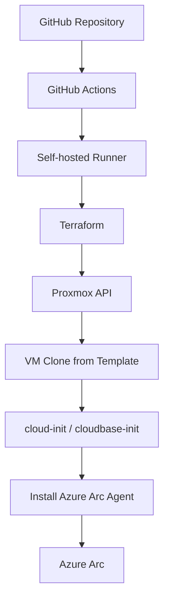

# 🏗 Proxmox VM Factory Lab

A **GitOps-driven VM factory** for provisioning virtual machines on **Proxmox VE** using **Terraform**, with automatic **Azure Arc onboarding** and CI/CD through **GitHub Actions**.

This lab demonstrates how to build a reproducible infrastructure platform where VMs are declared as code and automatically provisioned, configured, and registered in Azure Arc.

---

# 📐 Architecture Overview



---

# 🖥 Infrastructure Platform

**Hypervisor**  
Proxmox VE

**Node**

```
pve
```

**Storage**

```
local       → cloud-init snippets
local-lvm   → VM disks
```

**Network**

```
vmbr0
```

---

# 🧠 VM Factory Concept

VMs are defined declaratively in Terraform.

Example from `locals.tf`:

```hcl
vms = {
  ubuntu-static-01 = {
    os        = "linux"
    cores     = 2
    memory_mb = 4096

    network = {
      type    = "static"
      address = "192.168.10.30/24"
      gateway = "192.168.10.1"
    }

    arc = true
  }
}
```

Terraform converts this configuration into:

1. Proxmox VM provisioning
2. Cloud-init configuration
3. Azure Arc onboarding

---

# ⚙️ Supported Features

| Feature | Supported |
|------|------|
Linux VMs | ✅ |
Windows VMs | ✅ |
DHCP networking | ✅ |
Static IP configuration | ✅ |
Azure Arc onboarding | ✅ |
Arc disabled | ✅ |
GitOps deployment | ✅ |

---

# 📦 Terraform Repository Structure

```
.
├── main.tf
├── locals.tf
├── variables.tf
├── providers.tf
├── outputs.tf
├── checks.tf
│
├── cloudinit/
│   ├── linux.yaml.tftpl
│   └── windows.yaml.tftpl
│
└── .github/
    ├── workflows/
    │   ├── terraform-plan.yml
    │   ├── terraform-apply.yml
    │   └── terraform-destroy.yml
    │
    └── scripts/
        ├── extract_arc_names_from_plan.py
        └── extract_arc_names_from_state.py
```

---

# ☁ Azure Arc Integration

VMs are connected to Azure using the Azure Arc agent.

```
azcmagent connect
```

Authentication is performed using a **Service Principal** stored as GitHub Secrets.

Required secrets:

```
TF_VAR_arc_sp_id
TF_VAR_arc_sp_secret
TF_VAR_arc_tenant_id
TF_VAR_arc_subscription_id
TF_VAR_arc_resource_group
TF_VAR_arc_location
TF_VAR_arc_cloud
```

---

# 🔐 Service Principal Permissions

The Service Principal requires the following role:

```
Contributor
```

Assigned to the resource group:

```
rg-arc-vm-factory
```

---

# 🔄 Deployment Workflow

When pushing to the `main` branch:

```
terraform init
terraform plan
terraform show tfplan
cleanup Arc resources
terraform apply
```

Result:

1. Terraform clones a VM from the template in Proxmox
2. cloud-init or cloudbase-init configures the VM
3. Azure Arc agent is installed
4. The VM appears in Azure Arc

---

# 🗑 Destroy Workflow

When infrastructure is destroyed:

```
terraform destroy
```

The pipeline performs:

1. Reads Terraform state
2. Detects Arc-enabled machines
3. Deletes Azure Arc machine resources
4. Removes VMs from Proxmox

Result:

```
No orphan Azure Arc resources
```

---

# 📊 Current Lab Status

| Component | Status |
|------|------|
Proxmox API integration | ✅ |
Terraform provisioning | ✅ |
Self-hosted GitHub runner | ✅ |
Persistent Terraform state | ✅ |
Static networking | ✅ |
Azure Arc auto onboarding | ✅ |
Arc cleanup logic | ✅ |
CI/CD pipeline | ✅ |

---

# 🧠 Design Decisions

Terraform state is stored on the runner:

```
/opt/terraform-state/proxmox-ubuntu-vm-factory
```

Azure Arc onboarding occurs during VM provisioning.

```
arc = true
```

If Arc is disabled later, the VM must be disconnected manually or reprovisioned.

---

# 🚀 Possible Future Improvements

• Windows template automation  
• MicroK8s cluster provisioning  
• Terraform modules for VM profiles  
• Azure Policy governance via Arc  
• Automated patching via Azure Update Manager  

---

# 📜 License

MIT
