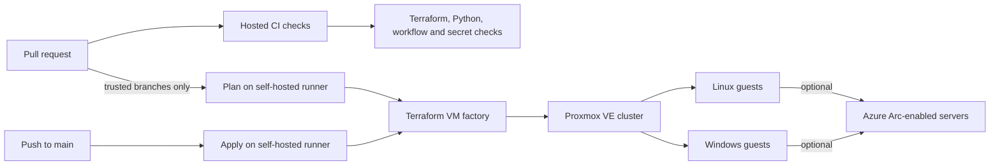

# Proxmox Multi-OS VM Factory with Azure Arc

[](https://github.com/johnhh-dev/proxmox-multios-vm-factory/actions/workflows/checks.yml)
[](https://developer.hashicorp.com/terraform)
[](https://www.proxmox.com/)
[](https://azure.microsoft.com/products/azure-arc)
[](LICENSE)

A Terraform-based VM factory for provisioning Linux and Windows guests on
Proxmox VE, with cloud-init, optional Azure Arc onboarding, and security-focused
GitHub Actions workflows.

This is a real homelab implementation and a portfolio project. It demonstrates
how infrastructure code is designed, tested, operated, and recovered—not only
how a VM resource is declared.

## What this project demonstrates

- A normalized, profile-driven VM inventory for Linux and Windows guests.
- DHCP and validated static network configuration.
- Template cloning, cloud-init/Cloudbase-Init, and optional disk growth.
- Short-lived Azure Arc onboarding tokens instead of long-lived guest secrets.
- Plan, apply, cleanup, destroy, and post-apply verification workflows.
- Defensive CI for untrusted pull requests and a privileged self-hosted runner.
- Tested failure handling, decision records, and operational runbooks.

## Architecture


```mermaid
flowchart LR
  PR[Pull request] --> Checks[Hosted CI checks]
  PR -->|trusted branches only| Plan[Plan on self-hosted runner]
  Main[Push to main] --> Apply[Apply on self-hosted runner]

  Checks --> Test[Terraform, Python, workflow and secret checks]
  Plan --> TF[Terraform VM factory]
  Apply --> TF
  TF --> PVE[Proxmox VE cluster]
  PVE --> Linux[Linux guests]
  PVE --> Windows[Windows guests]
  Linux -->|optional| Arc[Azure Arc-enabled servers]
  Windows -->|optional| Arc
```

The repository does not manage the existing MicroK8s cluster or its Argo CD
applications. They are adjacent lab infrastructure and are deliberately outside
this project's scope.

## Capability status

| Capability | Status |
|---|---|
| Linux provisioning and cloud-init | Verified on a real guest |
| DHCP and static networking | Implemented and tested |
| Azure Arc server onboarding | Verified on Linux |
| Windows provisioning and first-boot configuration | Rendered and tested; live first boot still needs re-verification |
| Inventory validation and normalization | Enforced by Terraform checks and tests |
| Kubernetes and Argo CD management | Out of scope |

Evidence from live guest verification is recorded in
[docs/verified-on-the-guests.md](docs/verified-on-the-guests.md).

## Example inventory

VMs are declared in `local.vms` in [locals.tf](locals.tf). Profiles provide
defaults, while explicit per-VM values take precedence.

```hcl
vms = {
  ubuntu-app-01 = {
    os        = "linux"
    profile   = "small"
    vm_id     = 1201
    disk_gb   = 60

    network = {
      type    = "static"
      address = "192.0.2.30/24"
      gateway = "192.0.2.1"
    }

    arc = {
      enabled = true
      tags    = { environment = "lab" }
    }
  }
}
```

The example uses the documentation-only `192.0.2.0/24` address range. Use
values appropriate for your own environment.

## Safe workflow

The workflows separate checks that can run without infrastructure access from
operations that require lab credentials:

| Workflow | Trigger | Runner | Purpose |
|---|---|---|---|
| `checks.yml` | Pull request and push to `main` | GitHub-hosted | Formatting, validation, linting, tests, documentation checks, and secret scanning |
| `terraform-plan.yml` | Pull request | Self-hosted | Plan against real state for trusted in-repository branches only |
| `terraform-apply.yml` | Push to `main` | Self-hosted | Preflight, inventory guard, Arc cleanup, apply, and verification |
| `terraform-destroy.yml` | Manual confirmation | Self-hosted | Arc cleanup followed by controlled destruction |

Notable safeguards include:

- Third-party actions and tool versions are pinned.
- Fork and Dependabot code does not execute on the privileged lab runner.
- Terraform plan output is captured and scanned before it is printed.
- Secrets and rendered guest configuration are audited separately.
- Protected infrastructure VM IDs are rejected during planning.
- Destroy removes Azure Arc resources before deleting their guests.

See [the runner trust boundary](docs/runner-trust-boundary.md) and
[plan-output redaction](docs/plan-output-redaction.md) for the reasoning.

## Validation

The public `checks` workflow is the authoritative validation path. For local
development:

```bash
terraform fmt -check -recursive
terraform init -backend=false -input=false
terraform validate
terraform test
tflint --format compact
```

The repository also contains focused Python test suites for workflow helpers,
inventory safety, Arc lifecycle handling, hostile template values, state
backup, and post-apply verification.

## Getting started

1. Build or identify compatible Linux and Windows templates using
   [docs/template-build.md](docs/template-build.md).
2. Configure the Proxmox API, SSH access, GitHub environments, variables, and
   secrets described in [docs/operator-setup.md](docs/operator-setup.md).
3. Review the security boundary before registering a self-hosted runner.
4. Add VMs to `local.vms` and open a pull request.
5. Review the hosted checks and the real infrastructure plan before merging.

This configuration uses a local backend tied to the lab runner. Do not run
`terraform apply` from a second workstation without first understanding
[state ownership and recovery](docs/state-recovery.md).

## Repository layout

```text
.
├── main.tf                 Proxmox VM and snippet resources
├── locals.tf               VM inventory, defaults, normalization, validation
├── variables.tf            Environment inputs and validation
├── checks.tf               Blocking inventory checks
├── arc.tf                  Azure Arc lifecycle markers
├── cloudinit/              Linux and Windows first-boot templates
├── tests/                  Terraform normalization tests
├── docs/                   ADRs, security notes, and operational runbooks
└── .github/
    ├── workflows/          Checks, plan, apply, and destroy pipelines
    ├── actions/            Reusable local workflow actions
    └── scripts/            Tested workflow and safety helpers
```

## Current lab inventory

The table is a dated operational snapshot, not an example configuration. CI
checks that its managed rows agree with `local.vms` and that protected VM IDs
agree with the Terraform configuration.

**Terraform manages none of the nine VMs.** The existing guests and templates
were observed on 2026-08-30; adoption decisions are documented in
[docs/unmanaged-vms.md](docs/unmanaged-vms.md).

| VMID | Name | Managed | Status |
|---|---|---|---|
| 1100 | `microk8s-01` | no | unmanaged |
| 1101 | `ubuntu-utils-01` | no | unmanaged |
| 1103 | `dns-01` | no | protected |
| 1104 | `wg-vpn-01` | no | protected |
| 1105 | `elastic-01` | no | protected |
| 1106 | `macos-ventura` | no | unmanaged |
| 1110 | `gha-runner-01` | no | protected |
| 9900 | `ubuntu-template` | no | template |
| 9917 | `win-server-2022-template` | no | template |

## Design and operations documentation

| Topic | Document |
|---|---|
| Architecture decisions | [ADR index](docs/adr/README.md) |
| Guest secret delivery | [ADR 0001](docs/adr/0001-guest-secret-delivery.md) |
| Template provenance | [ADR 0003](docs/adr/0003-template-provenance.md) |
| Terraform state | [ADR 0004](docs/adr/0004-terraform-state.md) |
| Runner placement | [ADR 0005](docs/adr/0005-runner-location.md) |
| Arc cleanup | [Arc cleanup runbook](docs/arc-cleanup.md) |
| Failed or orphaned resources | [Orphan VM](docs/incident-orphan-vm.md) · [Arc onboarding](docs/incident-arc-onboarding.md) |
| Release controls | [Release process](docs/release-process.md) |
| Remaining lab-dependent work | [Lab access required](docs/lab-access-required.md) |

## Known limitations

- No VM is currently declared in `local.vms`; the repository is ready for the
  next controlled build rather than claiming an active managed fleet.
- Windows first-boot behavior is tested at render level but has not yet been
  re-verified on a newly built Windows guest.
- Terraform state and same-disk backups remain on the self-hosted runner.
- The two-node Proxmox cluster has no qdevice, so loss of either node removes
  quorum. The apply workflow checks quorum before changing infrastructure.
- Editing cloud-init vendor data does not re-run first-boot configuration on an
  existing guest.

## Project history

This repository is a curated public snapshot created for portfolio use. The
detailed issue and pull-request history remains available in the
[development repository](https://github.com/johnhh-dev/proxmox-multios-vm-factory-v2).
The snapshot intentionally keeps the operational evidence and known limitations
without reproducing the full development history as artificial commits.

## License

Licensed under the [MIT License](LICENSE).
