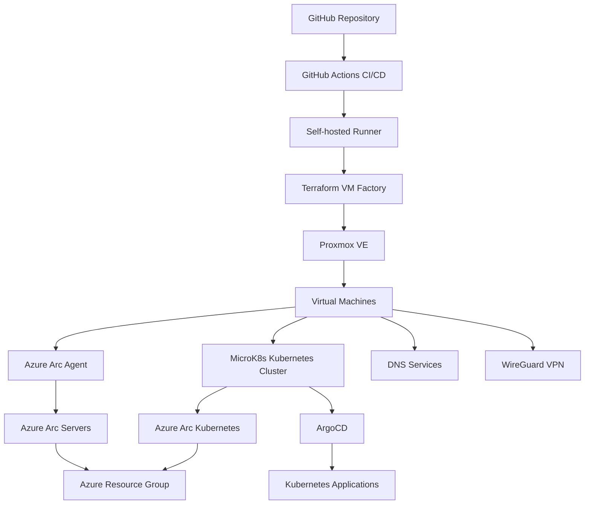

# 🏗 Hybrid Azure Arc + Proxmox + Kubernetes Lab


A **hybrid cloud lab environment** built to practice **Azure Arc, Kubernetes, Terraform, and DevOps automation** using a local **Proxmox infrastructure** integrated with **Microsoft Azure**.

This lab simulates a **real-world hybrid architecture** where on-premises virtual machines and Kubernetes clusters are managed from Azure using **Azure Arc**.

The environment is designed to support learning and experimentation for:

- **AZ-104 – Azure Administrator**
- **AZ-400 – DevOps Engineer**
- Hybrid infrastructure design
- Kubernetes operations
- Infrastructure as Code

---

# 🎯 Lab Objectives

This lab focuses on practicing:

- Hybrid cloud architecture
- Azure Arc server management
- Azure Arc Kubernetes integration
- Terraform infrastructure automation
- GitHub Actions CI/CD pipelines
- Kubernetes application delivery with **ArgoCD**
- Supporting services such as **DNS** and **WireGuard VPN**

Infrastructure provisioning and lifecycle is handled by **Terraform + GitHub Actions**, while **ArgoCD manages Kubernetes applications** inside the Kubernetes environment.

---

# 📐 High-Level Architecture


```mermaid
flowchart TD

A[GitHub Repository] --> B[GitHub Actions CI/CD]
B --> C[Self-hosted Runner]

C --> D[Terraform VM Factory]
D --> E[Proxmox VE]
E --> F[Virtual Machines]

F --> G[MicroK8s Kubernetes Cluster]
F --> H[Azure Arc Agent]
G --> I[Azure Arc Kubernetes]
H --> J[Azure Arc Servers]

J --> K[Azure Resource Group]
I --> K

F --> L[DNS Services]
F --> M[WireGuard VPN]
G --> N[ArgoCD]
N --> O[Kubernetes Applications]
```

---

# ☁ Azure Environment

Resource Group:

```text
rg-arc-home-lab
```

Region:

```text
Norway East
```

Azure is used for:

- Azure Arc server management
- Azure Arc Kubernetes integration
- Cluster Connect
- Policy & governance
- Monitoring and hybrid management

---

# 🖥 On-Prem Infrastructure

Hypervisor:

```text
Proxmox VE
```

Nodes:

```text
homelab: pve, pve2
```

**Two nodes, not one.** `var.proxmox_node_name` decides where a VM is built and
defaults to `pve`; `var.proxmox_ssh_nodes` declares both, because the provider
uploads the snippet over SSH and picks the node by name (OPS-005). This section
said `pve` while the inventory below described a cluster.

Network:

```text
vmbr0
```

Storage:

```text
local         → cloud-init snippets   (var.snippets_datastore)
zfs-vmstore   → VM and template disks (var.vm_datastore_id)
```

This said `local-lvm` for VM disks, which is not where anything is. Both
templates were measured on 2026-08-30 at `zfs-vmstore:base-9900-disk-1` and
`zfs-vmstore:base-9917-disk-0`, and `var.vm_datastore_id` has defaulted to
`zfs-vmstore` for as long as it has existed.

---

# 🧠 Terraform VM Factory

VM provisioning is fully automated using **Terraform**.

Terraform configuration defines VM specifications and automatically deploys machines to Proxmox using the Proxmox API. The repository now reflects the cleaned and current Terraform structure used by the lab.

Example VM definition:

```hcl
vms = {
  ubuntu-static-01 = {
    os        = "linux"
    cores     = 2
    memory_mb = 4096

    network = {
      type    = "static"
      address = "192.168.10.30/24"
      gateway = "192.168.10.1"
    }

    arc = true
  }
}
```

Supported features:

Checked row by row against shipped behaviour (DOC-003-A6). "Built" means a guest
has actually been created this way, not that the code path exists.

| Feature | Status |
|------|------|
| Linux VM | ✅ built — **none declared today.** VM 101 was the last one and was destroyed on 2026-08-30 |
| DHCP networking | ✅ |
| Static IP configuration | ✅ built, and malformed addresses are refused at plan (FEAT-003) |
| Blocking inventory validation | ✅ enforced at plan, and every rule has a test that proves it blocks (BUG-001) |
| GitHub Actions CI/CD | ✅ |
| Arc cleanup before VM destroy | ✅ implemented (BUG-004) |
| Azure Arc onboarding | ✅ **on Linux** — confirmed on `ubuntu-dhcp-01`, built and destroyed 2026-08-30. Never on Windows, see below |
| Windows VM | ❌ **not currently declared.** The one that existed never ran its first-boot script — [OPS-004](https://github.com/johnhh-dev/proxmox-multios-vm-factory-v2/issues/176) — and #178's fix for that stays unexercised until a Windows VM is built again |
| Idempotent Terraform workflows | ⚠️ a declared VM is stable across applies (BUG-012), but its snippet is rewritten on every run because the Arc token is minted per run |

The ⚠️ and ❌ rows are the honest ones, and two of them changed on 2026-08-30
when someone finally looked at the guests rather than at the code.

Arc onboarding **works**, on Linux, and had done for two days without anything
here saying so. The Windows first-boot script **has never executed at all** —
which means every Windows-side change in this repository (SEC-008, BUG-007,
BUG-010's Windows half, KAN-015, SEC-001c) is reviewed, tested against rendered
output, and unexecuted.

---

# 🖥 Virtual Machines

**Terraform manages none of the nine VMs.** All three entries in `local.vms`
([locals.tf](locals.tf)) are commented out rather than deleted:
`ubuntu-static-01`, `ubuntu-dhcp-01` and `win-srv-01`.

`ubuntu-dhcp-01` was the exception for one afternoon. It was declared, built as
VM 101 on 2026-08-30, and destroyed the same day by the apply on commit
`9bf6c57` — which is what commenting an entry out means here. The inventory
guard reads *empty desired, non-empty state* as **proceed, loudly**
([inventory_guard.py](.github/scripts/inventory_guard.py)), so the run planned
`0 to add, 0 to change, 3 to destroy`, deleted the guest and its snippet, and
removed the Arc machine first. Nothing about that is a defect. What it shows is
how little it takes: two characters, and every present-tense sentence on this
page about what the factory manages became false.

Captured from `pve` on 2026-08-30 — this replaces a five-VM table that was
presented as *"the current VM inventory shown in Proxmox"* while `local.vms` was
empty, and that named guests which do not exist under those names. **Nothing
kept the replacement true either.** It disagreed with the configuration again
within three hours of being written, which is why
[check_managed_inventory.py](.github/scripts/check_managed_inventory.py) now
fails the `checks` workflow when this table and `local.vms` differ.

| VMID | Name | Managed | Refused | Replicated to `pve2` | Note |
|---|---|---|---|---|---|
| 1100 | `microk8s-01` | no | no | yes | FEAT-004 (#62) asks to *build* this; it is running |
| 1101 | `ubuntu-utils-01` | no | no | yes | |
| 1103 | `dns-01` | no | **protected** | yes | every first boot waits on it to resolve |
| 1104 | `wg-vpn-01` | no | **protected** | yes | the management path in — KAN-011 (#25) |
| 1105 | `elastic-01` | no | **protected** | yes | declared off limits by the lab owner (#198) |
| 1106 | `macos-ventura` | no | no | yes | stopped, `onboot=0` |
| 1110 | `gha-runner-01` | no | **protected** | yes | **the runner** — OPS-003 (#171) |
| 9900 | `ubuntu-template` | template | — | — | 50 GB |
| 9917 | `win-server-2022-template` | template | — | — | 100 GB |

**Refused** is `var.protected_vm_ids` — four VMIDs this factory rejects at
plan time because it needs them in order to run, or because the lab owner
said so. [unmanaged-vms.md](docs/unmanaged-vms.md) argues each one, and
`check_protected_ids.py` keeps this column, `locals.tf` and that document
from drifting apart — which they had.

Three things in that table are worth more than the inventory itself.

**The runner is a guest of the hypervisor it manages.** OPS-003 (#171).
`var.protected_vm_ids` refuses a plan that declares 1110; whether the runner
should be here at all is open.

**A guest this factory builds has no replica.** All seven hand-built guests
replicate to `pve2` on a `*/15` schedule; VM 101 did not, for the afternoon it
existed. Replication here is configured per guest, by hand, outside this
repository - so a guest the factory builds gets no job, and an imported one
keeps none.

**This is a two-node cluster with no qdevice.** `homelab`, `pve` and `pve2`,
expected votes 2. Either node down leaves the other inquorate — see
[proxmox-cluster-quorum.md](docs/proxmox-cluster-quorum.md), which is why the
apply workflow preflights quorum before it starts (BUG-024).

The IDs 100–104 the old table claimed are **abandoned, not adopted**. Nothing
occupies any of them now, and **101 is reused by whatever the factory builds
next** — it belonged to `win-srv-01`, then to `ubuntu-dhcp-01`, and is free
again. That reuse is the argument for declaring `vm_id` rather than letting
Proxmox choose (FEAT-002): an ID that changes hands twice in a week is not an
identifier anyone can write down.

What remains of DOC-001 (#59) is the judgement rather than the discovery.
[unmanaged-vms.md](docs/unmanaged-vms.md) is the argument for each of the nine —
three the factory depends on and should not manage, three that are ordinary
candidates, two with no obvious answer — and what has to be true before any
import, which [ADR 0004](docs/adr/0004-terraform-state.md) says includes
FEAT-001-A2.

---

# ☸ Kubernetes Environment

> **Nothing in this repository manages, configures, verifies or so much as
> mentions any of this.** A search for `microk8s`, `argocd` or `metallb` across
> every `.tf`, `.py`, `.yml` and `.tftpl` file returns nothing. `microk8s-01`
> is VM **1100** — one of the nine unmanaged guests in the table above, and an
> import candidate per [unmanaged-vms.md](docs/unmanaged-vms.md).
>
> So what follows is a description of hand-built infrastructure, written from
> memory rather than measured. It is kept because the lab does run it and a
> reader should know it exists — flagged because the VM table two sections up
> said *"this is the current VM inventory shown in Proxmox"* in exactly this
> voice while `local.vms` was empty (DOC-001, #59).

Cluster:

```text
microk8s-01   (VM 1100, unmanaged)
```

Installed components, as remembered:

- MicroK8s
- Ingress Controller
- MetalLB
- Azure Arc agents
- **ArgoCD**

ArgoCD is used for **Kubernetes application delivery**.

**FEAT-004 (#62) asks to *build* a multi-node MicroK8s cluster** and this claims
one node already runs, which changes that issue from "build" to "adopt and
extend" — `unmanaged-vms.md` makes the same point about the import decision.
**FEAT-010 (#68) asks for ArgoCD application delivery as code**, which this
describes as already happening. Both readings cannot be right, and neither issue
has been reconciled against this section.

---

# ☁ Azure Arc – Kubernetes

> Same caveat. Arc **servers** onboarding is exercised on every apply and
> checked afterwards ([`arc_missing.py`](.github/scripts/arc_missing.py)); Arc
> **Kubernetes** is touched by nothing here. The command below has not been run
> by anything in this repository, and no record says a person has run it.

The MicroK8s cluster is connected to Azure using **Azure Arc for Kubernetes**.

Verify connection:

```bash
az connectedk8s show -g rg-arc-home-lab -n microk8s-01
```

Arc installs the following agents:

- clusterconnect-agent
- kube-aad-proxy
- extension-manager
- config-agent
- metrics-agent
- resource-sync-agent

These allow Azure to manage and monitor the Kubernetes cluster.

---

# ☁ Azure Arc – Servers

Arc-enabled servers are onboarded through the Terraform-based provisioning flow where enabled.

Check status:

```bash
az connectedmachine list -g rg-arc-home-lab
```

Capabilities include:

- Remote management
- Policy enforcement
- Monitoring
- Update management

---

# 🌐 DNS, Utility and Remote Access Services

Supporting infrastructure is now split across dedicated machines instead of being concentrated on a single utility host.

| Service | Host |
|---------|------|
| Utility / admin tooling | `ubuntu-utils-01` |
| DNS | `dns-01` |
| VPN / remote access | `wg-vpn-01` |

### ubuntu-utils-01 — VM 1101, unmanaged

Described here as hosting Azure CLI, Terraform and general admin tools.

**Two things in this repository disagree with that.**
[unmanaged-vms.md](docs/unmanaged-vms.md) lists 1101 as *"Referenced nowhere in
this repository"*, and Terraform does not run here — it runs on
`gha-runner-01`, which holds the state, the credentials and the whole pipeline
([runner-trust-boundary.md](docs/runner-trust-boundary.md)). Whatever this
machine is for, it is not the utility host the factory uses.

### dns-01 — VM 1103, refused

Provides DNS for the lab, and **every first boot blocks on it**: each guest
resolves `var.network_probe_host` before it does anything.
[management-network.md](docs/management-network.md) row 9 has the flow; that
dependency is why 1103 is on `var.protected_vm_ids`.

`var.dns_server` is `192.168.10.2` with `192.168.10.1` behind it — one host and
one fallback, and the fallback is the gateway.

### wg-vpn-01 — VM 1104, refused

Provides **WireGuard VPN** connectivity into the lab.

**Nothing here configures it, and nothing here knows its address range** — which
is the gap that stops KAN-011-A3 from naming the sources RDP and WinRM should be
restricted to. [management-network.md](docs/management-network.md) §3 and §5 are
the record: one `wg show` answers it.

---

# 🔄 Infrastructure CI/CD

Infrastructure changes are deployed through **GitHub Actions**. Four workflows,
and which runner they use is the important part — see
[docs/runner-trust-boundary.md](docs/runner-trust-boundary.md).

| Workflow | Trigger | Runner | What it does |
|---|---|---|---|
| `checks.yml` | every PR and push to `main` | `ubuntu-latest` | actionlint, `fmt`, `validate`, tflint, the Python suites, a secret scan. **No secrets, no lab access.** |
| `terraform-plan.yml` | pull request | `gha-runner-01` | plans against real state. Skipped for forks and for Dependabot. |
| `terraform-apply.yml` | push to `main` | `gha-runner-01` | Arc cleanup for departing VMs, then apply |
| `terraform-destroy.yml` | manual, with a typed confirmation | `gha-runner-01` | Arc cleanup for every Arc machine in state, then destroy |

A pull request therefore gets two independent verdicts: everything decidable
without the lab runs on a hosted runner first, and only then does anything
execute next to the Proxmox token.

**The plan is not printed until it has been scanned.** `terraform plan` output
is captured to a file, checked for every secret the job holds, and published
only if that check passes — see
[docs/plan-output-redaction.md](docs/plan-output-redaction.md).

The apply workflow does more than `terraform apply`:

1. Assert the state directory exists and is writable — no step uses `sudo`
2. Guard the inventory against the state (`TF_BOOTSTRAP`; see
   [docs/operator-setup.md](docs/operator-setup.md))
3. Mint a short-lived Azure token for guest onboarding (SEC-001a)
4. Plan, scan the output, publish it
5. Delete the Arc machine resources of any VM the plan removes
6. Apply

Then, in the guest: cloud-init or Cloudbase-Init runs the first-boot
configuration, installs the Arc agent where enabled, and the machine appears in
Azure Arc.

**A template edit does not reach a guest that already exists.** cloud-init runs
its first-boot logic once. See
[docs/guest-config-changes.md](docs/guest-config-changes.md) for what a
vendor-data change does and does not do.

---

# 🗑 Destroy Workflow

`terraform-destroy.yml` is manual and requires a typed confirmation, which is
read as an environment variable rather than interpolated into the shell
(SEC-005).

The pipeline:

1. Reads Terraform state
2. Detects Arc-enabled machines, by the name each registered under — which is
   not necessarily the VM's own name (BUG-019)
3. Deletes those Azure Arc machine resources
4. Removes the VMs from Proxmox

**Arc cleanup runs before the destroy, and a failure fails the job.** A stale
machine resource blocks re-onboarding under the same name, and the next create
then fails inside a guest days later with an error that says nothing about the
destroy. That is why it is worth stopping for — the reasoning, and the recovery
if one is left behind anyway, are in
[docs/arc-cleanup.md](docs/arc-cleanup.md).

Two things this does **not** cover:

- **Setting `arc = false` on a running VM does not remove it from Azure.**
  Cleanup is driven by which VMs are being destroyed, deliberately, so that
  toggling a flag cannot silently delete a machine resource.
- **A VM that Terraform never recorded is invisible to this path.** A create
  that fails partway leaves a guest behind with no state entry —
  [docs/incident-orphan-vm.md](docs/incident-orphan-vm.md) is the runbook.

---

# 📦 Repository Structure

```text
.
├── main.tf                # the VM and snippet resources
├── arc.tf                 # Arc registration markers (BUG-019)
├── providers.tf           # provider, versions, local backend
├── variables.tf
├── locals.tf              # the VM inventory - this is the file you edit
├── outputs.tf
├── checks.tf              # makes the inventory rules blocking (BUG-001)
├── LICENSE
├── .gitignore
├── .gitattributes
├── .tflint.hcl
├── .terraform.lock.hcl    # provider checksums; move it with the constraint
├── cloudinit/
│   ├── linux.yaml.tftpl
│   ├── windows.yaml.tftpl
│   ├── Unattend.xml
│   ├── cloudbase-init.conf.actual          what template 9917 has
│   └── cloudbase-init.conf.wrong-and-kept  what it was thought to have
├── docs/
│   ├── adr/               # decision records, and what is still undecided
│   ├── operator-setup.md  # secrets, prerequisites, TF_BOOTSTRAP
│   ├── guest-config-changes.md
│   ├── arc-cleanup.md
│   ├── incident-orphan-vm.md
│   ├── proxmox-api-token.md
│   ├── proxmox-cluster-quorum.md
│   ├── plan-output-redaction.md
│   ├── runner-trust-boundary.md
│   └── version-pinning.md
└── .github/
    ├── actionlint.yaml
    ├── dependabot.yml     # action and provider bumps (CHORE-006)
    ├── workflows/
    │   ├── checks.yml         # hosted gate: lint, fmt, validate, tests, secrets
    │   ├── terraform-plan.yml
    │   ├── terraform-apply.yml
    │   └── terraform-destroy.yml
    ├── actions/           # arc-cleanup, arc-token, terraform-env
    └── scripts/           # helpers, each with a test_*.py beside it
```

Every Python helper under `.github/scripts/` is covered by a test in the same
directory, and all of those tests run in `checks.yml`. The names do not always
pair one to one — both Arc extractors are covered by `test_arc_extractors.py`,
because they answer the same question from a plan and from state.

---

# 🔧 Self-Hosted Runner

| Setting | Value |
|---------|-------|
| Runner | gha-runner-01 |
| Labels | self-hosted, Linux, X64 |
| Execution | systemd service |

Terraform state location:

```text
/opt/terraform-state/proxmox-ubuntu-vm-factory
```

**The `ubuntu` in that path is deliberate, and stale** (DOC-003-A5). The
repository was renamed to `proxmox-multios-vm-factory-v2`; the state directory
was not. Renaming it now would point the backend at an empty path and strand
the existing state, so the old name is retained until FEAT-001 (#56) provides a
backup and restore path that makes moving it safe. Until then, treat the path as
an identifier rather than a description — and note that a second lab using the
same path would collide with this one's state.

Backend:

```text
local
```

**Single file, no locking, and a backup only on the same disk.** Both workflows
copy the state into `backups/` before they touch the backend and keep the last
twenty (FEAT-001-A3), which covers a bad apply, a truncated state and anyone
running `terraform` by hand — but **losing the runner still loses the state**,
because the copies go with the disk. That last part is what
[ADR 0004](docs/adr/0004-terraform-state.md) decides: encrypted copies off the
runner as the step available today, and an `azurerm` backend with its own
identity as the answer — at the cost of every plan gaining a hard dependency on
Azure. [state-recovery.md](docs/state-recovery.md) is the runbook.

---

# 🧠 Design Decisions

The decisions themselves live in **[docs/adr/](docs/adr/)**, which indexes every
record and says which decision has not been made yet. This section used to be
three sentences with no reasoning and no alternatives, which is why the audit
could not tell whether local state was a trade-off or an accident (DOC-006, #74).

| Decision | Record |
|---|---|
| How secrets reach a guest at first boot | [ADR 0001](docs/adr/0001-guest-secret-delivery.md) |
| How the two templates get built, and what this factory requires of them | [ADR 0003](docs/adr/0003-template-provenance.md) |
| How to build one that satisfies it | [template-build.md](docs/template-build.md) |
| What happens when Arc cleanup fails during a destroy | [arc-cleanup.md](docs/arc-cleanup.md) |
| Why a guest can boot cleanly and never appear in Azure | [incident-arc-onboarding.md](docs/incident-arc-onboarding.md) |
| Whether editing a template rebuilds a running guest | [guest-config-changes.md](docs/guest-config-changes.md) |
| What may execute on the lab runner | [runner-trust-boundary.md](docs/runner-trust-boundary.md) |
| What gates a push to `main`, and what only looks like a gate | [release-process.md](docs/release-process.md) |
| Which changes have actually been watched working on a guest | [verified-on-the-guests.md](docs/verified-on-the-guests.md) |
| Everything still open, and why it needs someone at the lab | [lab-access-required.md](docs/lab-access-required.md) |
| Why every dependency is pinned, and how they get updated | [version-pinning.md](docs/version-pinning.md) |
| Why plan output is redacted | [plan-output-redaction.md](docs/plan-output-redaction.md) |
| Which WinRM transport a Windows guest gets, and why not HTTPS yet | [windows-winrm.md](docs/windows-winrm.md) |
| Every management flow into and out of the lab, and who owns it | [management-network.md](docs/management-network.md) |
| Where Terraform state lives, and what a remote backend costs | [ADR 0004](docs/adr/0004-terraform-state.md) |
| Whether the runner should move off the node it manages | [ADR 0005](docs/adr/0005-runner-location.md) |

Three things worth knowing without following a link:

**Terraform state is a single local file on the self-hosted runner**, backed up
only to the same disk and with no verified locking. Losing the runner loses the
state and its backups together. That was the status quo rather than a chosen
design; [ADR 0004](docs/adr/0004-terraform-state.md) is the decision, and
SEC-001e (#120) is a precondition for acting on it — migrating a file full of
historical cleartext into a new store copies the problem into it.

**Azure Arc onboarding happens in the guest during first boot** when a VM sets
`arc = true`. Terraform never manages the
`Microsoft.HybridCompute/machines` resource, because the guest creates it by
running `azcmagent connect` on itself.

**Setting `arc = false` on a VM that is already onboarded does not remove it from
Azure.** That is deliberate, not an oversight: cleanup is driven by which VMs are
being destroyed, so that disabling a flag cannot silently delete a machine
resource. Destroying the VM does remove it — see
[arc-cleanup.md](docs/arc-cleanup.md).

---

# 🚀 Future Improvements

Tracked on the issue board, not here (DOC-003-A7). Every item this section used
to list already has an issue, and two backlogs describing the same work is how
they drift apart:

| Was listed here | Issue |
|---|---|
| Multi-node Kubernetes cluster | FEAT-004 (#62) |
| Azure Monitor integration | FEAT-005 (#63) |
| Azure Policy enforcement | FEAT-006 (#64) |
| GitOps infrastructure modules | FEAT-010 (#68), FEAT-007 (#65) |
| Automated patching via Update Manager | FEAT-008 (#66) |
| Hardening for VPN and Windows management | KAN-011 (#25), KAN-015 (#19) |

The audit and its remediation plan are **EPIC-000 (#32)**.

---

# 📜 License

[MIT](LICENSE).

The licence was claimed here for some time with no `LICENSE` file behind it,
which made it an assertion rather than a grant (DOC-004). The file exists now.
